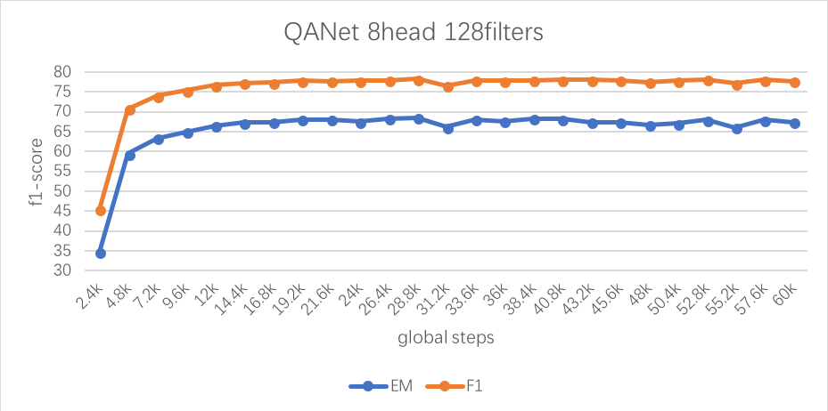

## QANet in keras
QANet: https://arxiv.org/abs/1804.09541

This keras model refers to QANet in tensorflow (https://github.com/NLPLearn/QANet). ~~and the self-attention & position embedding are used from (https://kexue.fm/archives/4765, https://github.com/bojone/attention)~~. Now the self-attention & position embedding are also revised from (https://github.com/NLPLearn/QANet).
> We find that the conv based multi-head attention in (https://github.com/NLPLearn/QANet/blob/master/layers.py) performs 3%~4% better than the multiplying matrices based one in (https://github.com/bojone/attention/blob/master/attention_keras.py).

## Pipline
1. Download squad data from (https://rajpurkar.github.io/SQuAD-explorer/).

2. Run `preprocess.ipynb` and `handcraft.ipynb` to get npys of the preprocessed data and handcraft features.

3. Run `train_QANet.py` to start training.

4. Fast demo: Use the god made `model.fit()` in `QANet_fit_demo.py` with random numpy data.

## Updates
- [x] Add EMA (with about 3% improvement)
- [x] Add multi gpu (speed up)
- [x] Support adding handcraft features
- [x] Revised the MultiHeadAttention and PositionEmbedding in keras
- [x] Support parallel multi-gpu training and inference
- [x] Add layer dropout and revise the dropout bug (with about 2% improvement)
- [x] Update the experimental results and related hyper-parameters (Coming soon)
- [x] Revise the output Layer `QAoutputBlock.py`(with about 1% improvement)
- [ ] Add slice operation to QANet(get the max context length from each batch dynamically to speed up the model)
- [ ] Add data augmentation

I find that EMA in keras is hard to implement in GPU, and the training speed is greatly affected by it in keras. Besides, it's hard to add the slice op in keras too, so the training speed is further slower(about 2 times compared with the optimized tensorflow version...). Moreover, there is also 2% gap of keras compared with the tensorflow version(https://github.com/NLPLearn/QANet).

## Results
Result on dev set of squad
